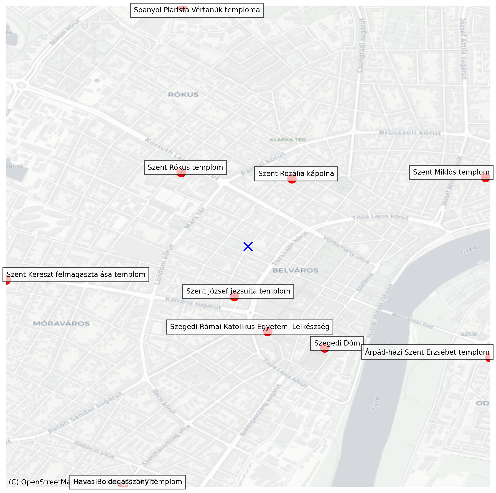

# templom-terkep
Templomok térképe egy adott városban. Később miserenddel is. :)

## Használat

- Poetry telepítés: `pip install poetry`
- Függőség telepítés: `poetry install`
- Indítás: `poetry run python templom-terkep.py`

## Kapcsolók

- `--city-name`: A település neve, ha nincs megadva, bekéri futásnál, ha nem lesz megadva: `Szeged`
- `--output-filename`: A kimeneti képfájl neve, ha nincs megadva, bekéri futásnál, ha nem lesz megadva: `terkep.png`
- `--distance`: A maximális távolság m-ben, ha nincs megadva, bekéri futásnál, ha nem lesz megadva: `5000`
- `--show-center`: A térkép középpontjának megjelenítése (elsősorban debug célra)
- `--select-churches`: A térképen megjelenő templomok kiválasztása interaktívan egy listából
- `--color-map`: színesebb térkép

## A program működése

1. Nominatim API-ról lekéri a megadott település koordinátáját
2. [Miserend.hu](miserend.hu) API NearBy végpontjáról lekéri a közeli templomokat
    - Ha a `--select-churches` kapcsoló be van kapcsolva, interaktívan kiválaszthatja a megjeleníteni kívánt templomokat.
3. A templomok pozíciói alapján kiszámolja a szükséges térkép nagyságát
4. 'Csempekiszolgálótól' letölti a térképcsempéket, hogy szép térképet eredményezzen. (színesebb esetén: `OSM Mapnik`, kevésbé színes esetén: `CartoDB Positron`)
5. Ráhelyezi a térképre a templomok címkéjét
6. Elmenti a térképet

## Minta

